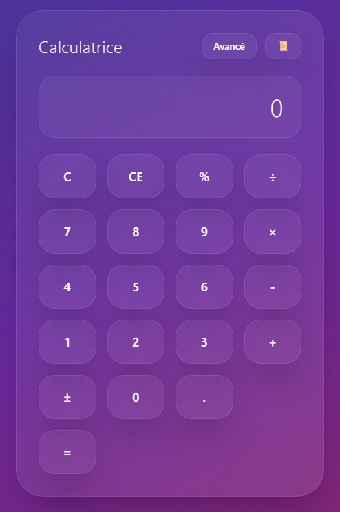
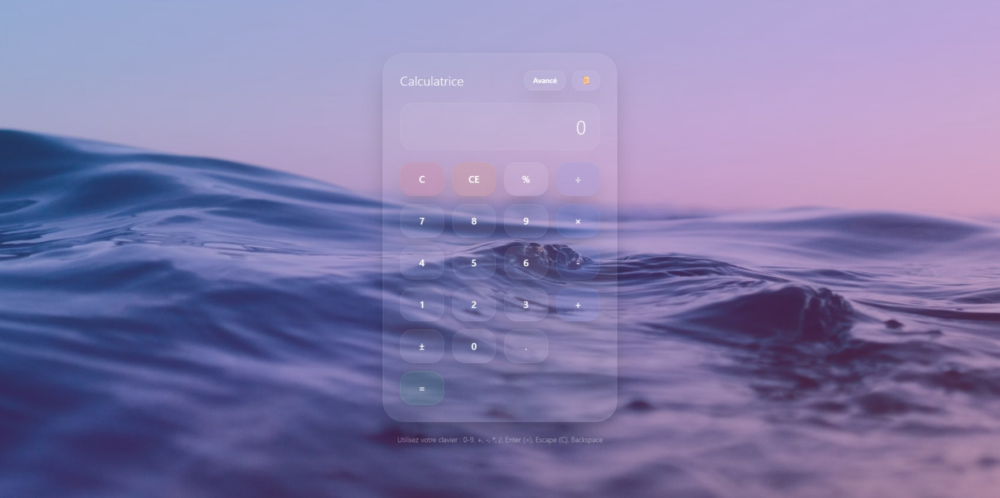
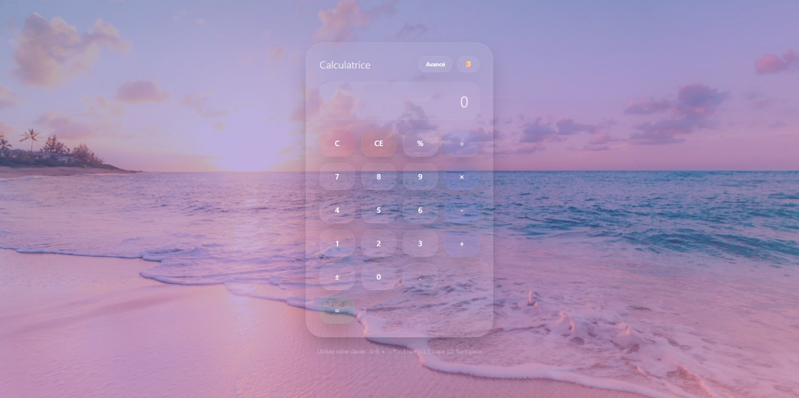

# 🌌 Glass Calculator



An advanced **glassmorphism-style calculator** built with **HTML, CSS (TailwindCSS), and JavaScript**.  
Designed with a sleek *liquid glass UI*, dynamic animated backgrounds, and both **basic** and **scientific** calculator features.  

---

## ✨ Features

### 🎨 Design & UI
- **Glassmorphism aesthetic** with blur, transparency, and smooth shadows.
- **Dynamic animated backgrounds**:
  - 6 high-quality Unsplash backgrounds.
  - Random order transitions with fade + zoom-in effect (Ken Burns style).
- **Responsive design** – works seamlessly on desktop and mobile.
- **Smooth button interactions** with hover and press animations.

### 🧮 Calculator Modes
- **Basic Mode**:
  - Numbers `0–9`
  - Decimal point `.`
  - Arithmetic operations: `+`, `−`, `×`, `÷`
  - Percentage `%`
  - Sign toggle `±`
  - Clear `C` / Clear Entry `CE`
  - Memory support: `M+`, `M-`, `MR`, `MC`
- **Advanced Mode** (Scientific):
  - Trigonometry: `sin`, `cos`, `tan` (degree mode)
  - Logarithms: `log` (base 10), `ln` (natural log)
  - Square root `√x`
  - Powers: `x²`, `x³`
  - Reciprocal `1/x`
  - Factorial `x!`
  - Constants: `π`, `e`

### 📜 History
- Keeps a **calculation history** (up to 20 entries).
- Easily toggle history panel with a button.
- Clear visual separation of past calculations.

### ⌨️ Keyboard Support
- Full keyboard integration:
  - Numbers: `0–9`
  - Operations: `+`, `-`, `*`, `/`
  - Equals: `Enter` or `=`
  - Clear: `Escape`
  - Backspace support
  - Percentage: `%`
- Works seamlessly with both **mouse** and **keyboard**.

### ⚡ Performance
- Lightweight, no dependencies except **TailwindCSS**.
- No external calculator libraries – everything coded in pure JavaScript.
- Optimized transitions and background animations.

---

## 🚀 Installation & Usage

1. Clone this repository:
   ```bash
   git clone https://github.com/your-username/glass-calculator.git
```

2. Navigate to the project folder:

   ```bash
   cd glass-calculator
   ```

3. Open `glass-calculator-html.html` in your browser:

   ```bash
   open glass-calculator-html.html   # macOS
   start glass-calculator-html.html  # Windows
   xdg-open glass-calculator-html.html  # Linux
   ```

✅ That’s it – no server required!

---

## 📸 Screenshots




---

## 🛠️ Built With

* **HTML5**
* **CSS3 / TailwindCSS**
* **JavaScript (Vanilla)**

---

## 📌 Roadmap / Possible Improvements

* [ ] Dark mode toggle.
* [ ] Configurable background sets.
* [ ] Support for radians in trigonometric functions.
* [ ] PWA support (installable calculator app).
* [ ] Unit conversions (length, weight, temperature).
* [ ] Voice input.

---

## 🤝 Contributing

Contributions, issues, and feature requests are welcome!
Feel free to fork this repo and submit a pull request.

---

## 📜 License

This project is licensed under the **MIT License** – see the [LICENSE](LICENSE) file for details.

---

## 💡 Inspiration

Inspired by modern **glassmorphism UI** trends and the desire to merge **beauty + functionality** into a calculator app.

