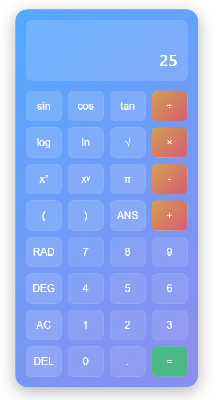

# Liquid Glass Scientific Calculator 🌊🔮



A stunning scientific calculator with Apple Liquid Glass-inspired design, featuring advanced mathematical functions, smooth animations, and a beautiful translucent interface.

## ✨ Features

### 🎨 Stunning UI Design
- **Liquid Glass aesthetic** with blur effects and transparency
- **Dynamic gradient backgrounds** that shift subtly
- **Smooth animations** for button presses and transitions
- **Responsive layout** that works on all device sizes

### ➕ Basic Operations
- All standard calculator functions (+, -, ×, ÷)
- Decimal point input
- Clear (AC) and delete (DEL) functions
- Parentheses support for complex expressions

### 🔬 Scientific Functions
- **Trigonometric functions**: sin, cos, tan (DEG/RAD modes)
- **Logarithmic functions**: log (base 10), ln (natural log)
- **Exponents and roots**: x², xʸ, √
- **Constants**: π (pi)
- **Memory function**: ANS (recall last result)

### ⌨️ Enhanced Usability
- **Full keyboard support** (type calculations directly)
- **Previous operation display**
- **Visual feedback** on button presses
- **Optional sound effects** (uncomment in code to enable)

## 🚀 Getting Started

### Prerequisites
- Modern web browser (Chrome, Firefox, Safari, Edge)
- (Optional) Local web server for development

### Installation
1. Clone the repository:
   ```bash
   git clone https://github.com/Clementabcd/Liquid-Glass-Scientific-Calculator.git
   ```
2. Open `index.html` in your browser

### Alternative: Use Without Installation
Simply copy the HTML, CSS, and JavaScript code into a single HTML file and open it in your browser.

## 🛠️ Development

### File Structure
```
liquid-glass-calculator/
├── index.html          # Main HTML file
├── styles.css          # CSS styles (optional separate file)
├── script.js           # JavaScript functionality
├── assets/             # Optional assets folder
│   ├── sounds/         # Button click sounds
│   └── images/         # Background images
└── README.md           # This file
```

### Customization Options
1. **Change color scheme**:
   Modify the CSS variables in `:root`:
   ```css
   :root {
     --primary-color: rgba(10, 132, 255, 0.7); /* Blue */
     --secondary-color: rgba(94, 92, 230, 0.7); /* Purple */
   }
   ```

2. **Add background image**:
   Replace the background URL in the CSS:
   ```css
   body {
     background: url('your-image.jpg') no-repeat center center fixed;
   }
   ```

3. **Enable sound effects**:
   Uncomment the audio line in the JavaScript:
   ```javascript
   // new Audio('click.wav').play().catch(e => {});
   ```

## 🌟 Advanced Features to Implement

Want to contribute? Here are some great enhancements:

1. **Graphing capabilities** - Visualize mathematical functions
2. **Unit conversions** - Length, weight, temperature, etc.
3. **Equation solver** - Solve for variables
4. **History panel** - View past calculations
5. **Theme selector** - Multiple color schemes
6. **Mobile app version** - iOS/Android ports

## 📚 How It Works

### Technical Architecture
- **HTML5**: Structure of the calculator
- **CSS3**: Styling with modern features like `backdrop-filter`
- **JavaScript**: All calculation logic and interactivity

### Key Algorithms
1. **Shunting-yard algorithm** (for operator precedence)
2. **Trigonometric calculations** with DEG/RAD conversion
3. **Memory management** for ANS functionality
4. **Input validation** to prevent invalid expressions

## 📱 Responsive Design

The calculator automatically adapts to:
- Desktop screens
- Tablets
- Mobile phones
- Different aspect ratios

## 🎨 Design Philosophy

1. **Skeuomorphic** - Mimics real glass materials
2. **Neumorphic** - Soft shadows and highlights
3. **Minimalist** - Only essential UI elements
4. **Accessible** - Good contrast and large touch targets

## 📜 License

MIT License - Free for personal and commercial use

## 🙏 Acknowledgments

- Inspired by Apple's Liquid design language
- Calculator logic based on standard scientific calculators
- Glass morphism design trend

---

Enjoy using this beautiful calculator! For issues or feature requests, please open an issue on GitHub.
